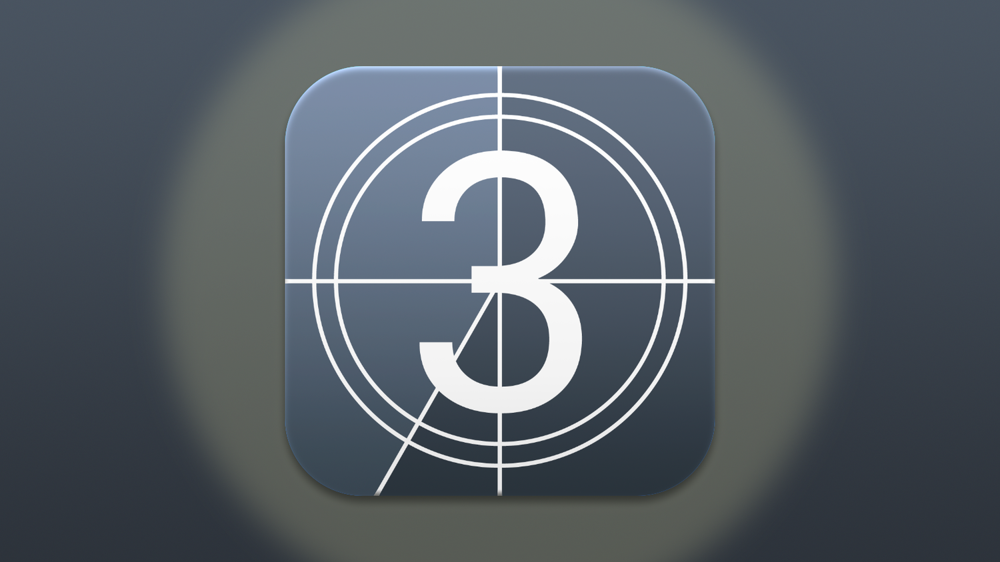
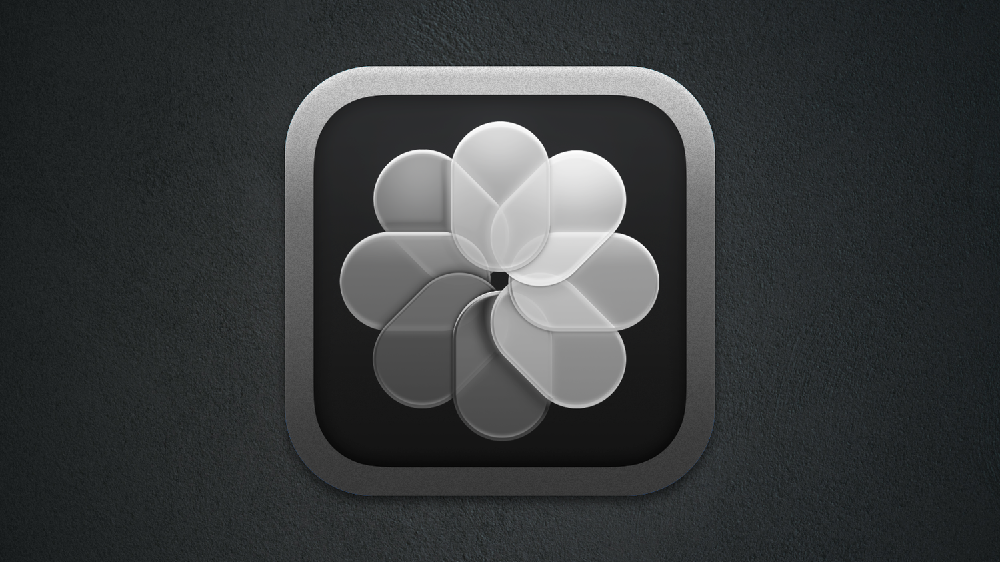
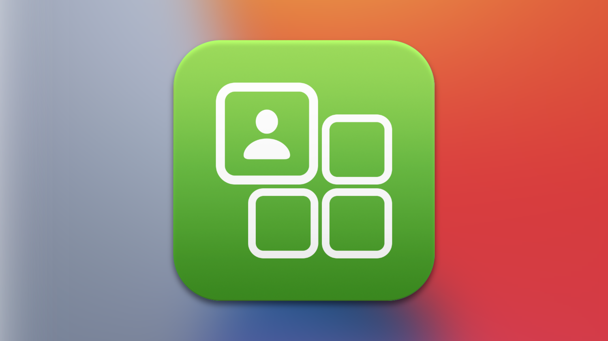
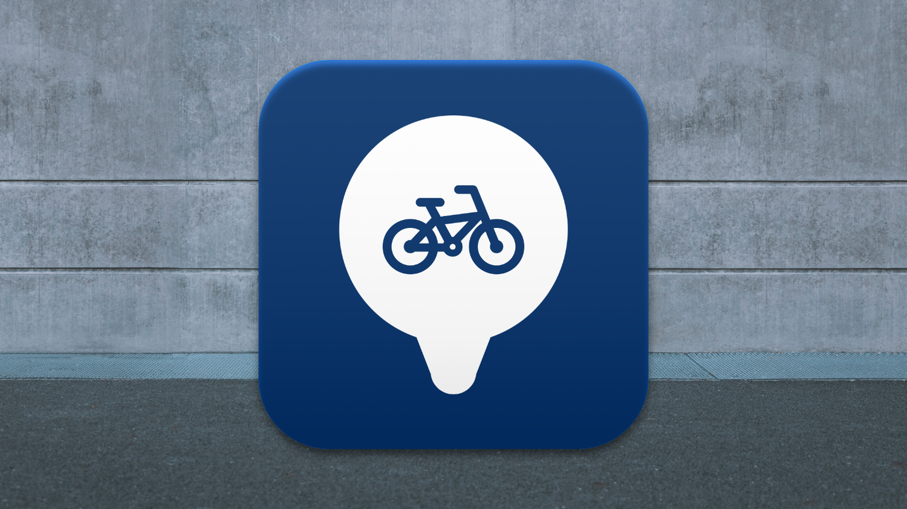

# Emilio Peláez
**iOS Developer since 2009, sherlocked in 2011**. He/Him.

Director, Mobile Engineering @ [Modus Create](https://github.com/ModusCreateOrg)

Read about me on my [website](http://emiliopelaez.me) or find me on [Mastodon](https://mastodon.social/@emiliopelaez)

## AppStore

  
  
  
  

 - [Action! Countdowns](https://apps.apple.com/us/app/action-countdowns/id1457799658) - Beautiful, simple countdowns
 - [Private Vault](https://apps.apple.com/us/app/private-vault-storage/id1558429748) - Keep your files away from prying eyes
 - [Speed Dial Widgets](https://apps.apple.com/us/app/phone-home-widgets/id1550574694) - Contacts on your Home Screen
 - [Valenbisi Stations](https://apps.apple.com/us/app/valenbisi-stations/id1530171896) - Bike Sharing information for Valencia

## Articles
 - [Building a Responder Chain Using the SwiftUI View Hierarchy](https://medium.com/p/2a08df23689c)
 - [Recreating Instagram’s Page Control](https://medium.com/@Pelaez/recreating-instagrams-page-control-ebc2103b8a39)
 - [I Haven’t Used a Light Switch in over a Year](https://medium.com/@Pelaez/i-havent-used-a-light-switch-in-over-a-year-c9261abb8912)
